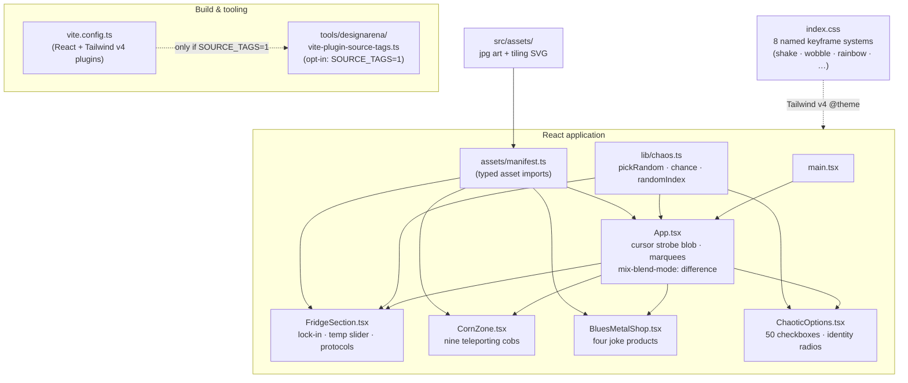

# FRIDGE LOCKER 3000

> A deliberately cursed interactive web experience: refrigeration, corn worship,
> and blues-metal e-commerce. You will be marquee'd at. You cannot eat the fridge corn.

[](https://github.com/zazieproductions/Fridge-Locker-3000/actions/workflows/ci.yml)
[](LICENSE)
[](package.json)
[](https://react.dev)
[](https://vite.dev)
[](tsconfig.app.json)
[](docs/decisions/0002-remove-platform-telemetry.md)

---

## What is this?

**Fridge Locker 3000** is a single-page interactive art piece in the tradition of
cursed-web maximalism: a garbage-core memorial to corn, refrigeration, and
blues-metal merch. It strobes, shakes, marquee's, inverts itself through your
cursor, offers you fifty checkboxes you do not need, and asks you to lock
yourself inside a refrigerator. The temptation is irresistible; the unlock
button is labeled honestly.

This repository is the **curated,
production-grade edition** of that piece: the platform telemetry is gone, the
five assets the code referenced but never shipped now exist, the whole thing is
typed, tested, linted, and CI-gated — and not one ounce of the intentional
weirdness has been sanded off. See [docs/creative-methodology.md](docs/creative-methodology.md)
for the curatorial stance and [docs/decisions/](docs/decisions/) for the decision log.

## Why it exists

1. **As art** — to explore what a UI looks like when every "best practice"
   dial is turned to 11 on purpose: saturation, motion, information density,
   dishonest affordances, and emotional violence, all in one scroll.
2. **As an engineering artifact** — to prove that even an intentionally
   unhinged piece can and should be _professionally engineered underneath_:
   clean boundaries, build-time guarantees, tests, CI, and documentation,
   without sanitizing the surface.
3. **As a case study** — in taking an AI-generated artifact and turning it into
   something a team could actually own: auditable, tracker-free, and reproducible.

## What it does

Four sections, one continuous sensory incident:

| Section                                       | What it does                                                                                                                                                                                                | Status              |
| --------------------------------------------- | ----------------------------------------------------------------------------------------------------------------------------------------------------------------------------------------------------------- | ------------------- |
| **Fridge Locker 3000**                        | Lock yourself in (the unlock button admits it's impossible). Adjust internal temperature from −100°F to 100°F. Invoke FREEZE / THAW / CRUSH / CRY protocols, which always fail with `ERROR: TOO MUCH CORN`. | Implemented         |
| **Corn Zone**                                 | Nine individually-clickable cobs that teleport to random poses with **no reset button**. A spinning corn fractal. A "CONSUME THE COB" marquee. A WORSHIP CORN button.                                       | Implemented         |
| **Blues Metal Emporium**                      | Four joke products (Rust-Bucket Distortion Pedal — $666.66), spinning product photography, and a "now playing" bar for _Frozen Corn Blues in E Minor_. Nothing can actually be purchased.                   | Implemented         |
| **Options You Don't Need**                    | Fifty checkboxes where toggling one may toggle a **random bystander**; identity radios ("I am a fridge") that sometimes select themselves on hover; a doom dropdown that changes nothing.                   | Implemented         |
| Sound (the ▶ button actually plays the blues) |                                                                                                                                                                                                             | Roadmap — see below |

Global features: a mouse-following strobe blob rendered through
`mix-blend-mode: difference` (the page double-exposes itself as you move),
dual rainbow marquee headers/footers, a seamlessly tiling background pattern,
and a `prefers-reduced-motion` valve that relaxes the storm for visitors whose
OS requests it (the default experience is untouched).

## Demo / preview

**Live demo:** once enabled, the site deploys to GitHub Pages on every push to
`main` via [`.github/workflows/deploy.yml`](.github/workflows/deploy.yml):
`https://zazieproductions.github.io/Fridge-Locker-3000/`
_(one-time owner step: Settings → Pages → Source: **GitHub Actions** — see
[docs/repository-admin.md](docs/repository-admin.md))._

Run it locally:

```bash
npm install
npm run dev          # → http://localhost:5173
```

> ⚠️ **Content warning (sincere):** rapid flashing (10 Hz color strobing),
> sustained screen shake, and marqueeing text. The `prefers-reduced-motion`
> media query removes most of it if your OS requests reduced motion.

## Architecture

One React 19 SPA, no router, no data layer — all state is local and ephemeral,
which is itself part of the statement (you cannot save your corn progress).



Design notes worth reading: [docs/architecture.md](docs/architecture.md) covers
the chaos systems, the blend-mode stack, and why some impurity survives on
purpose; [docs/designarena-platform.md](docs/designarena-platform.md) documents
the platform layer that was removed.

## Quick start

```bash
git clone https://github.com/zazieproductions/Fridge-Locker-3000.git
cd Fridge-Locker-3000
npm install          # Node ≥ 20.19
npm run dev
```

## Installation

Requirements: **Node ≥ 20.19** (CI tests 20 and 22) and npm. No database, no
environment variables, no services — the piece is fully self-contained.

```bash
npm install          # install dependencies
npm run validate     # prove everything works: types + lint + format + tests + build
```

## Usage

After `npm run dev`, the intended interaction script:

1. Move the mouse. The page inverts through your cursor blob.
2. Read the marquee. It is not kidding.
3. **LOCK ME IN!** — commit to the fridge. Try to leave.
4. Drag the temperature slider to −100°F. You will feel it.
5. Press FREEZE, THAW, CRUSH, and CRY. Accept the corn error.
6. Click each of the nine cobs. Accept that they are gone now.
7. Attempt to buy the Rust-Bucket Distortion Pedal ($666.66). Fail.
8. In _Options You Don't Need_: toggle checkboxes and watch bystanders flip;
   hover the identity radios carefully — you are what you nearly hover.
9. Choose your doom from the dropdown. It changes nothing.

## Configuration

There is nothing to configure — by design. The single opt-in flag is for
development tooling:

| Variable      | Default   | Purpose                                                                                                                                                                                                                                                                                                                       |
| ------------- | --------- | ----------------------------------------------------------------------------------------------------------------------------------------------------------------------------------------------------------------------------------------------------------------------------------------------------------------------------- |
| `SOURCE_TAGS` | `0` (off) | `SOURCE_TAGS=1 npm run dev` stamps every JSX element with `data-source-loc="file:line:col"` at compile time, enabling the archived DesignArena element picker (toggle with <kbd>Alt</kbd>+<kbd>Shift</kbd>+<kbd>I</kbd>). Never enabled in production builds. See [tools/designarena/README.md](tools/designarena/README.md). |

## Project structure

```
Fridge-Locker-3000/
├── .github/workflows/
│   ├── ci.yml                    # typecheck + lint + format + tests + build + telemetry guard
│   └── deploy.yml                # GitHub Pages deployment (on main)
├── docs/
│   ├── architecture.md           # systems, data flow, motion engine, chaos table
│   ├── creative-methodology.md   # the curatorial stance and the rules of the piece
│   ├── designarena-platform.md   # anatomy of the original export; what was kept/removed
│   ├── repository-admin.md       # one-time owner tasks (Pages, description, topics)
│   └── decisions/                # ADRs: curation stance, telemetry removal, assets, testing chaos
├── public/
│   └── favicon.svg               # corn cob favicon
├── src/
│   ├── assets/
│   │   ├── manifest.ts           # single typed import surface for all art
│   │   ├── *.jpg / ugly-bg.svg   # the art (see assets/README.md)
│   │   └── README.md
│   ├── components/               # the four sections (+ colocated tests)
│   ├── lib/
│   │   ├── chaos.ts              # shared randomness primitives
│   │   └── chaos.test.ts
│   ├── App.tsx                   # composition, strobe blob, marquees
│   ├── App.test.tsx
│   ├── index.css                 # Tailwind v4 @theme: the 8 keyframe systems
│   └── main.tsx
├── tests/
│   └── setup.ts                  # vitest + jest-dom setup
├── tools/
│   └── designarena/              # archived platform tooling (telemetry quarantined,
│       └── ...                   # opt-in source-tags plugin + element picker)
├── index.html                    # 0.72 kB — no scripts, no trackers
├── vite.config.ts                # plugins + vitest config
├── eslint.config.js              # type-aware linting
└── tsconfig*.json                # strict, noUncheckedIndexedAccess
```

## Development

| Command                           | What it does                                   |
| --------------------------------- | ---------------------------------------------- |
| `npm run dev`                     | Dev server with HMR at `http://localhost:5173` |
| `npm run build`                   | Type-check then production build to `dist/`    |
| `npm run preview`                 | Serve the production build locally             |
| `npm run lint` / `lint --fix`     | ESLint (type-aware)                            |
| `npm run format` / `format:check` | Prettier                                       |
| `npm run typecheck`               | `tsc -b` across app + node projects            |
| `npm run test` / `test:watch`     | Vitest (26 tests)                              |
| `npm run validate`                | Everything above — what CI runs                |

House rules (enforced by review, mostly by CI):

- **Never re-add platform telemetry.** CI greps `dist/` for
  `designarena|rrweb|arena:` and fails the build. See
  [ADR 0002](docs/decisions/0002-remove-platform-telemetry.md).
- **Never sanitize the art.** Impurity is content; the chaos primitives live in
  [src/lib/chaos.ts](src/lib/chaos.ts) precisely so it can be intentional.
  See [ADR 0001](docs/decisions/0001-curate-dont-sanitize.md).
- Images are imported only via [src/assets/manifest.ts](src/assets/manifest.ts) —
  a missing asset is a build error, never a broken ``.

## Testing

The chaos is deterministic under test: [src/lib/chaos.test.ts](src/lib/chaos.test.ts)
verifies the randomness primitives at seeded boundaries, and component tests
mock `Math.random` to exercise both branches of the bystander-checkbox and
hover-select behavior. Render-phase purity is enforced by
`react-hooks/purity`; new randomness must live in state initializers, event
handlers, or `lib/chaos.ts` — never in render paths.

```bash
npm test            # 26 tests, 6 suites
npm run test:watch  # watch mode
```

## Troubleshooting

| Symptom                                         | Cause                                                                                                                                                         | Fix                                                                          |
| ----------------------------------------------- | ------------------------------------------------------------------------------------------------------------------------------------------------------------- | ---------------------------------------------------------------------------- |
| `npm ERR! engines` on install                   | Node < 20.19 (Vite 7 requirement)                                                                                                                             | Upgrade Node, or use nvm: `nvm use 22`                                       |
| Build warning: `…/ugly-bg.png didn't resolve`   | You are on a pre-curation commit                                                                                                                              | Update to ≥ `f3bcb9a` ("fix(assets)")                                        |
| Animations feel calm / stopped                  | Your OS requested `prefers-reduced-motion` — the valve engaged                                                                                                | This is a feature. Disable reduced motion to restore the storm               |
| The piece is unbearable                         | Working as intended                                                                                                                                           | Step 6 of [creative methodology](docs/creative-methodology.md#consent-valve) |
| `SOURCE_TAGS=1 npm run dev` shows no difference | Tags are invisible attributes; use the element picker (paste `tools/designarena/element-picker/element-picker.vendor.js` into the console, press Alt+Shift+I) | —                                                                            |
| Checkbox flipped itself                         | Bystander toggle (p = 0.5). Checkbox independence is not among the options you don't need                                                                     | —                                                                            |

## Roadmap

**Implemented** (this is the complete feature set — nothing below is fake):

- [x] Four-section interactive piece with global strobe/marquee layer
- [x] Eight-system motion engine (Tailwind v4 `@theme` keyframes)
- [x] Chaos primitives with test coverage; CI-gated typecheck/lint/format/build
- [x] Tracker-free production build (CI-enforced)
- [x] `prefers-reduced-motion` consent valve

**Candidates for future work** (ideas, not commitments):

- [ ] **The blues, audible** — the Emporium's play buttons are theatrical; a
      tiny Web Audio blues riff in E minor would make them real (12 bars, not a streaming service)
- [ ] **Corn persistence** — `sessionStorage` high-score table for "cobs teleported"
- [ ] **Screenshot gallery** — real captures for this README (contributor-friendly:
      the app is one page and photographs itself)
- [ ] **GitHub Pages demo** — workflow is merged; needs the one-time owner switch
      (see [docs/repository-admin.md](docs/repository-admin.md))

**Deliberately not planned:** real payments, a backend, analytics of any kind,
routing, or state persistence beyond a session. The piece ends when the tab closes.

## Contributing

Read [CONTRIBUTING.md](CONTRIBUTING.md) — the short version: run
`npm run validate` before pushing, keep the art intact, add tests for chaos
behavior through seeded mocks, and write an
[ADR](docs/decisions/) before changing anything architectural.

## License

[MIT](LICENSE) © Zazie Productions. The art assets in `src/assets/` are
AI-generated for this repository (see [src/assets/README.md](src/assets/README.md));
the original piece was generated by Gemini 3 Pro in the DesignArena tournament —
see [docs/designarena-platform.md](docs/designarena-platform.md) for full
provenance. Do not eat the fridge corn.
