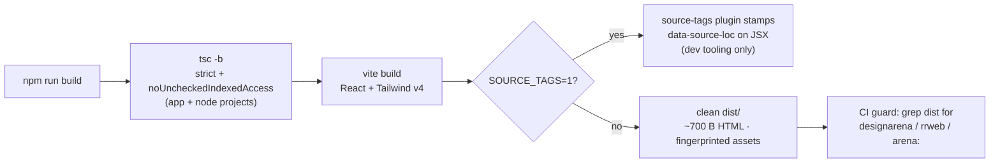

# Architecture

Fridge Locker 3000 is a single-page React 19 application with no router, no
server, and no persistence. This document explains the systems that exist and
the boundaries between them. For the _why_, read
[creative-methodology.md](creative-methodology.md); for the _what was removed_,
read [designarena-platform.md](designarena-platform.md).

## Module map

```
main.tsx ──► App.tsx ──┬──► components/FridgeSection.tsx
                       ├──► components/CornZone.tsx
                       ├──► components/BluesMetalShop.tsx
                       ├──► components/ChaoticOptions.tsx
                       ├──► assets/manifest.ts   (typed art imports)
                       └──► lib/chaos.ts         (randomness primitives)

index.css  ──► Tailwind v4 @theme block: 8 named keyframe systems
               + page chrome (background tile, marquees, scrollbar)
```

Boundaries, and the rule each one enforces:

| Boundary             | Rule                                                                                                                                                                                                                                                                                |
| -------------------- | ----------------------------------------------------------------------------------------------------------------------------------------------------------------------------------------------------------------------------------------------------------------------------------- |
| `assets/manifest.ts` | The only place image URLs may be written. Vite fingerprints everything; a missing file fails the build.                                                                                                                                                                             |
| `lib/chaos.ts`       | The home of runtime randomness _primitives_ (`pickRandom`, `chance`, `randomIndex`). Direct `Math.random()` is additionally permitted in exactly two render-safe places — state initializers and event handlers — so `react-hooks/purity` can verify no impurity leaks into render. |
| `index.css` `@theme` | The only place keyframes are defined. Components reference animation _names_ (`animate-shake`), never raw CSS.                                                                                                                                                                      |
| `components/*`       | Each section owns its state locally. No section reads another's state; the page has no shared store.                                                                                                                                                                                |

## The chaos systems

All randomness is centered on `src/lib/chaos.ts` (primitives) plus the two
render-safe impurity sites the purity rule allows (state initializers, event
handlers):

| Primitive           | Used by                           | Behavior                                             |
| ------------------- | --------------------------------- | ---------------------------------------------------- |
| `pickRandom(items)` | `App` (strobe palette)            | Uniform member of a non-empty array; throws on empty |
| `chance(p)`         | `ChaoticOptions`                  | True with probability _p_                            |
| `randomIndex(n)`    | `ChaoticOptions` (bystander pick) | Uniform integer in `[0, n)`                          |

The three callers constitute the piece's chaos surface:

1. **Cursor strobe blob** (`App.tsx`) — every 100 ms, re-rolls one of six
   palette colors into a radial gradient that follows the mouse. Because the
   root element carries `mix-blend-mode: difference`, the blob inverts the
   page beneath it; the gradient's transparency falloff produces a moving
   double-exposure. **Load-bearing weirdness:** remove the blend mode and the
   page becomes an ordinary site with a colorful dot on it.
2. **Bystander checkbox toggle** (`ChaoticOptions`) — toggling checkbox _i_
   also toggles `checkboxes[randomIndex(50)]` with p = 0.5. Consequence:
   checkbox state is not reproducible by the user, which is the point.
3. **Hover-select** (`ChaoticOptions`) — hovering an identity radio selects it
   with p = 0.3, inverting the normal affordance (approaching a choice may
   make it for you).

Two further random behaviors are _anchored_ rather than continuous: the
protocol buttons' `animation-delay`s (rolled once at mount so FREEZE/THAW/CRUSH/CRY
shake out of phase) and the checkbox tilts (rolled at mount, re-rolled in the
toggle handler so the grid visibly re-scatters when touched).

### Render purity vs. intentional impurity

React's rules say render must be pure — and `react-hooks/purity` (part of the
react-hooks v7 ESLint preset) enforces it here. Every random value the UI
shows is therefore produced in a state initializer or an event handler, never
during render. This is not a compromise: it is what makes the chaos
**testable**. Tests mock `Math.random` and assert exact outcomes; see
`ChaoticOptions.test.tsx` for the two-branch bystander test.

## The motion engine

`src/index.css` defines eight keyframe systems in a Tailwind v4 `@theme` block,
exposed as utilities (`animate-shake`, `animate-wobble`, `animate-rainbow`,
`animate-blink`, `animate-spin-fast`, `animate-spin-reverse`,
`animate-marquee`, `animate-pulse-fast`). Composition happens in class
attributes — e.g. the cursor blob stacks `animate-spin-fast` with
`mix-blend-exclusion`, and sections layer `rotate-2`/`-rotate-3` transforms on
top of shake/wobble animations.

Two details worth knowing:

- **Marquee** is a double system: `.marquee-container` (overflow hidden,
  nowrap) wraps `.marquee-content(-fast)` translating `100% → -100%`. The
  footer uses `mix-blend-color-burn` against whatever scrolls beneath it.
- **Consent valve** — the `prefers-reduced-motion: reduce` media query at the
  bottom of `index.css` collapses all animation/transition durations to
  0.01 ms and iteration counts to 1. The layout and content are unchanged;
  only the motion storm stops. This is the piece's single concession to
  physiology, and it is deliberate that it defaults _off_.

## Build pipeline



- `tsc -b` builds the **app project** (`src`, `tests`) and the **node project**
  (`vite.config.ts`, `tools/designarena/vite-plugin-source-tags.ts`) as
  referenced projects, so tooling is type-checked with the same severity as
  the app.
- The source-tags plugin is a first-class dev dependency — the original export
  silently relied on `@babel/*` arriving as _transitive_ dependencies of
  `@vitejs/plugin-react`, which worked until it didn't. They are now declared,
  typed, and the CJS/ESM interop is handled explicitly.
- `npm run validate` (what CI runs, on Node 20 and 22): typecheck → lint →
  format check → tests → build → telemetry grep.

## Performance notes

Honest measurements, not pretense:

- The 100 ms strobe interval re-renders `App` (and therefore all four
  sections — they are not memoized) ten times per second. This is affordable
  at this DOM size (~200 nodes) and it _is_ the aesthetic. If the page ever
  grows, wrap the sections in `React.memo` before touching the interval.
- Total payload after curation: ~1 MB uncompressed, ~70 kB gzipped for
  JS+CSS; the three JPEGs account for ~670 kB (800×800, q85). Lazy-loading
  below-the-fold images (`loading="lazy"`) is a trivial, aesthetic-safe win
  that has not yet been applied.
- No timers besides the strobe interval; no leaks — the effect cleans up its
  listener and interval on unmount.

## Deliberate non-architecture

The following are absent **on purpose**, and their absence is documented so
nobody "fixes" them: no router (one page; scrolling is the navigation), no
state library (nothing survives the tab), no backend (the Emporium cannot
transact, and that is the joke), no analytics (see
[ADR 0002](decisions/0002-remove-platform-telemetry.md)), no i18n (the piece
speaks fluent ALL-CAPS).
